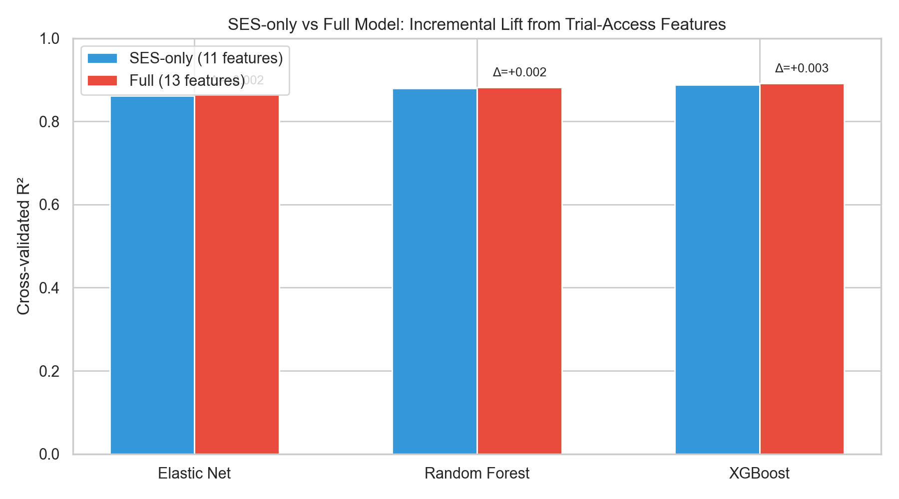
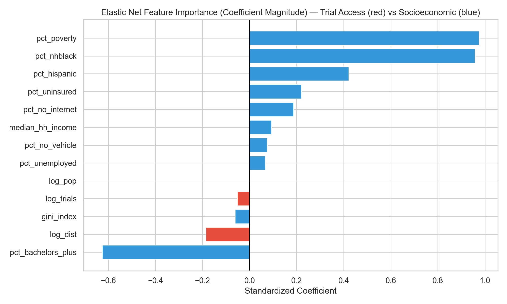
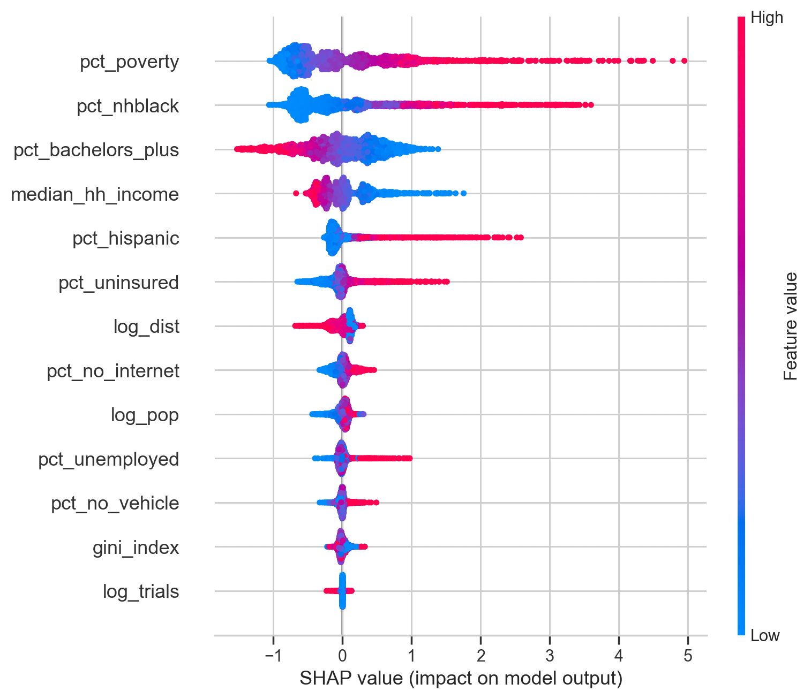
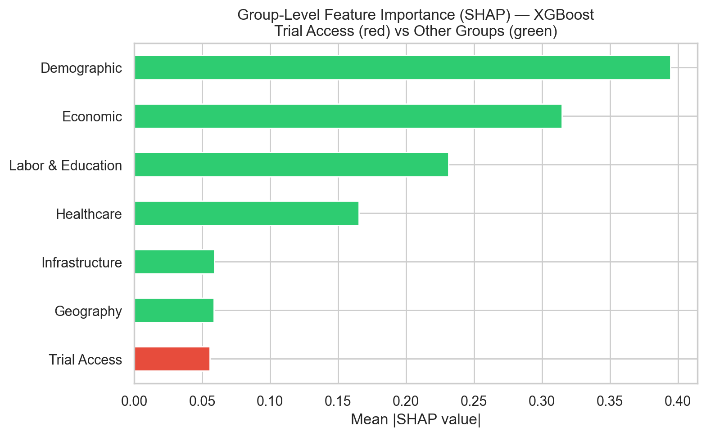

> **Interactive figures.** On the [Interactive Visualizations page](viz.qmd), Figures 1, 2, and 3 are interactive versions of this report's state choropleth (Figure 1) and county distance histogram (Figure 3), plus an interactive scatter of county prevalence versus trial distance. Full source and pipeline: <https://github.com/shifosss/diabetes-trial-access-gap>.

# Introduction

## Background and Motivation

Type 2 diabetes is one of the largest chronic disease burdens in the United States, and the burden isn't distributed evenly. Prevalence is highest across the South and Appalachia, and much of the county-to-county variation tracks with socioeconomic conditions such as poverty rate and insurance coverage (Barker et al., 2011; Hill-Briggs et al., 2021). Clinical trials are how new diabetes therapies get developed and eventually approved, but where a trial actually runs is usually decided by the sponsor and by whichever institutions already have the infrastructure to host one. The result is that rural and high-burden counties often have no local site, which makes enrollment harder for the residents most affected and weakens the generalizability of the evidence the trials produce (Tanner et al., 2015; Unger et al., 2019; Kirkwood et al., 2024).

## Research Questions and Hypotheses

This project addresses two related but distinct aims:

1. **Descriptive aim.** To what extent is the geographic distribution of U.S. Type 2 diabetes clinical trial sites aligned with the spatial pattern of disease burden? Where are the largest gaps between trial availability and local need?

2. **Modeling aim.** Does including clinical trial access measures (local trial density and distance to the nearest trial site) improve prediction of county-level diabetes prevalence beyond a model that uses only socioeconomic and demographic characteristics, and which features carry the most predictive signal?

Two working hypotheses drive the analysis. First, trial sites should cluster in counties that already have research infrastructure (large health systems, academic medical centers) and relatively advantaged socioeconomic profiles, rather than in the highest-burden counties. Second, once socioeconomic and demographic structure is already in a prediction model for diabetes burden, adding trial-access features shouldn't do much. If trial access is itself a byproduct of the same structural factors, it should carry little independent predictive information.

# Methods

## Data Acquisition

The full dataset was assembled exclusively via programmatic API pulls to compile a multi-dimensional, county-level dataset of the United States:

1. **Clinical trial access** — ClinicalTrials.gov v2 API: all U.S. Type 2 diabetes studies ever registered (no date filter), a cumulative snapshot of where trial infrastructure has been placed.
2. **Disease burden** — CDC PLACES: county-level age-adjusted diabetes prevalence and related population-health measures (2022 release cycle; underlying BRFSS data 2020–2022).
3. **Socioeconomic context** — American Community Survey 5-Year 2022 estimates (pooling 2018–2022) for county and state covariates including poverty, income, education, insurance, and demographic composition.
4. **Healthcare infrastructure** — NPI Registry: endocrinologist counts and academic medical center presence by county.

Supplementary contextual variables came from the 2020 Census Decennial (rural population share by state) and a hardcoded lookup of Medicaid expansion status as of January 2024. The 2022 Census Gazetteer and FCC Census API were used for geocoding. All sources are cross-sectional; temporal misalignment across vintages is modest because structural county characteristics change slowly relative to the one- to two-year offsets between sources.

## Data Cleaning and Wrangling

The raw nested JSON payloads from ClinicalTrials.gov were flattened into separate trial-level and site-level records. Because the clinical-trial data encoded locations as city/state strings rather than FIPS identifiers, the 2022 Census Gazetteer combined with the FCC Census API (reverse geocoding latitude/longitude to FIPS) was used to map each trial site to a 5-digit county FIPS code. To measure geographic isolation, straight-line distances were computed using the Haversine formula and `scipy.spatial.cKDTree` from each county's population centroid to the nearest trial site. All datasets were merged on the county FIPS code. Missing values for core modeling features were handled via complete-case analysis, and highly skewed variables (total population, trial distance, and trial density) were log-transformed (`log1p` or `log`) to stabilize variance.

## Analytical Tools and Modeling

EDA and feature engineering used pandas and numpy; static visualizations were produced with seaborn and matplotlib, and the interactive figures on the companion [Visualizations page](viz.qmd) with Plotly. The response variable for Aim 2 is **county-level age-adjusted diabetes prevalence** (`places_diabetes` from CDC PLACES). The 13 predictors fall into two groups: *trial-access variables* (log trial density, log distance to the nearest site) and *socioeconomic/demographic covariates* (poverty rate, median household income, Gini index, uninsured rate, unemployment rate, bachelor's-degree attainment, vehicle access, internet access, % non-Hispanic Black, % Hispanic, and log population).

**Baseline vs. augmented prediction comparison.** To isolate the predictive contribution of trial-access features, each model was fit in two configurations: an *SES-only baseline* using the 11 socioeconomic/demographic predictors, and a *Full* model adding the two trial-access predictors. Comparing cross-validated R², RMSE, and MAE between configurations quantifies the incremental lift from trial-access features. Three model families were used:

- **Elastic Net** (scikit-learn `ElasticNetCV`; 5-fold CV over five `l1_ratio` values and 100 `alpha` values; predictors standardized): a regularized linear model whose coefficient magnitudes indicate feature importance under linearity.
- **Random Forest** (`RandomForestRegressor` tuned via 30-iteration randomized search over trees, depth, leaves, and feature fractions): a non-linear ensemble. Permutation importance ranks features by their contribution to out-of-sample accuracy.
- **XGBoost** (`XGBRegressor` tuned via 30-iteration randomized search over n_estimators, learning rate, depth, subsample, and column subsample): gradient-boosted trees that typically achieve the highest predictive accuracy.

All three models were evaluated under the same 5-fold cross-validation scheme (shuffled, `random_state=42`). **Feature importance** was assessed with SHAP values from the best-performing model (XGBoost), permutation importance from the tuned Random Forest, and standardized coefficients from Elastic Net.

# Results

## Descriptive: State and County Access Gaps (Aim 1)

The data pipeline aggregated 3,646 U.S. Type 2 diabetes studies and 47,118 site records. Because 73.4% of U.S. counties host no diabetes trial site at all, state-level summaries are the primary descriptive lens; county-level results supplement them by quantifying the within-state variation that state aggregates mask.

### State-Level Burden and Trial Density Do Not Line Up Cleanly

::: {#fig-state-maps layout-ncol=2}
{width=100%}

{width=100%}

**Figure 1.** State tile maps: diabetes prevalence (left) vs. trial density (right). The diabetes belt in the South and Appalachia is visible in the left panel, while the trial-density map is more fragmented and includes several smaller, infrastructure-rich states that do not rank among the highest-burden areas.
:::

To formalize the mismatch, a state-level *coverage residual* was computed: observed trial density minus the trial density expected for a state's diabetes-burden decile. Negative values indicate under-coverage relative to peer states with similar burden; positive values indicate over-coverage.

{#fig-residual width=100%}

**Figure 2.** Coverage residual by state. The residual analysis sharpens the map comparison. Several high-burden states are under-covered relative to peers in the same burden decile, while some Mountain Plains and small-jurisdiction states sit well above the density their burden decile would predict. Sponsor composition skews heavily toward industry: nationally, industry-sponsored trial density is 5.39 trials per 100k population versus 0.78 for non-industry trials, roughly 6.9× higher. That skew lines up with the picture of site placement being driven by sponsor logistics and institutional presence rather than local burden.

**Table 1. Five most under-covered states relative to diabetes burden.**

| State | Trial count | Site count | Trials per 100k | Coverage residual | Industry share (%) |
|---|---:|---:|---:|---:|---:|
| WY | 1 | 1 | 0.17 | -8.58 | 0.0 |
| AK | 8 | 9 | 1.09 | -7.66 | 87.5 |
| NH | 98 | 103 | 7.10 | -5.11 | 96.9 |
| WI | 221 | 285 | 3.76 | -4.50 | 88.2 |
| CO | 458 | 685 | 7.94 | -4.28 | 80.8 |

**Table 2. Five most over-covered states relative to diabetes burden.**

| State | Trial count | Site count | Trials per 100k | Coverage residual | Industry share (%) |
|---|---:|---:|---:|---:|---:|
| ID | 301 | 376 | 16.23 | 7.48 | 99.7 |
| ND | 119 | 132 | 15.32 | 6.57 | 99.2 |
| DC | 125 | 136 | 18.64 | 6.43 | 70.4 |
| NE | 283 | 404 | 14.45 | 6.19 | 92.6 |
| KS | 351 | 475 | 11.96 | 4.92 | 94.6 |

The picture from Figures 1–2 and Tables 1–2 is the same: state trial density isn't uniformly high or low; what varies most is how closely it tracks the underlying burden.

### County-Level Access Gaps Are Large

State aggregates mask within-state variation. Of 3,221 counties, only 856 (26.6%) host at least one diabetes trial site; the other 2,365 (73.4%) have none. County-level trial density is therefore zero-inflated, and county modeling (Aim 2) relies on the distance-to-nearest-site measure rather than local trial counts to capture access variation.

**Table 3. County-level access summary.**

| Metric | Value |
|---|---:|
| Counties in final county file | 3,221 |
| Counties with at least one trial site | 856 (26.6%) |
| Counties without a trial site | 2,365 (73.4%) |
| Median nearest-site distance among no-site counties | 58.4 km |
| Share of no-site counties more than 50 km away | 59.7% |
| Share of no-site counties more than 100 km away | 24.0% |
| Share of no-site counties more than 200 km away | 8.2% |

{#fig-distance width=100%}

**Figure 3.** County-level distance distribution. For no-site counties, travel distance is often substantial. A state can look moderately well covered in aggregate while still leaving most of its counties without feasible local trial access. An interactive version with a per-state filter is available on the [Visualizations page](viz.qmd).

Among counties with at least one trial site, endocrinologist density and trial density tend to co-occur; both likely reflect the same academic medical centers and large health systems. The bivariate scatter (available on the [Visualizations page](viz.qmd)) is descriptive only; the Aim 2 models test whether these features contribute independent predictive signal.

## Modeling: Trial-Access Features Add Little Predictive Lift (Aim 2)

Each of the three model families (Elastic Net, Random Forest, XGBoost) was fit twice under a 5-fold shuffled CV scheme: once with the 11 SES/demographic predictors only, and once with the same features plus the two trial-access variables (`log_trials`, `log_dist`). The incremental lift from trial-access features is the difference in CV R² (and RMSE/MAE) between the two configurations.

```{python}
#| label: cv-comparison-table
from pathlib import Path
import pandas as pd
from IPython.display import Markdown

comp_path = Path("option-c-trial-access/product/data/modified/temp/model_comparison_cv.csv")

def _fmt(x, nd=4):
    return f"{x:.{nd}f}"

if comp_path.exists():
    comp = pd.read_csv(comp_path)
    wide = comp.pivot_table(
        index="Model", columns="Features",
        values=["R²", "RMSE", "MAE"], aggfunc="first",
    ).reindex(["Elastic Net", "Random Forest", "XGBoost"])

    header = (
        "| Model | R² (SES-only) | R² (Full) | ΔR² (Full − SES-only) | "
        "RMSE (SES-only) | RMSE (Full) | MAE (SES-only) | MAE (Full) |\n"
        "|---|---:|---:|---:|---:|---:|---:|---:|"
    )
    rows = []
    for m in wide.index:
        r2_ses, r2_full   = wide.loc[m, ("R²",   "SES-only")], wide.loc[m, ("R²",   "Full")]
        rmse_ses, rmse_full = wide.loc[m, ("RMSE", "SES-only")], wide.loc[m, ("RMSE", "Full")]
        mae_ses,  mae_full  = wide.loc[m, ("MAE",  "SES-only")], wide.loc[m, ("MAE",  "Full")]
        delta = r2_full - r2_ses
        rows.append(
            f"| {m} | {_fmt(r2_ses)} | {_fmt(r2_full)} | {delta:+.4f} | "
            f"{_fmt(rmse_ses)} | {_fmt(rmse_full)} | {_fmt(mae_ses)} | {_fmt(mae_full)} |"
        )

    caption = (
        "**Table 4. Cross-validated performance — SES-only baseline vs. Full model "
        "(adds `log_trials` and `log_dist`).**\n\n"
    )
    display_out = Markdown(caption + header + "\n" + "\n".join(rows))
else:
    display_out = Markdown(
        "**Table 4.** _Model comparison CSV not yet generated. Run "
        "`python option-c-trial-access/product/_regenerate_cv_comparison.py` "
        "(or render `option-c.qmd`) to populate `temp/model_comparison_cv.csv`._"
    )

display_out
```

Table 4 reports the CV metrics for the six model-configuration combinations. Across all three model families the Full model's R² improvement over the SES-only baseline is small in absolute terms, and the trial-access variables don't meaningfully reduce cross-validated prediction error. XGBoost comes out on top, and the ranking (XGBoost ≳ Random Forest > Elastic Net) holds across configurations. That matches what you'd expect if the non-linear models are picking up interactions among SES predictors that linear regularization can't reach.

{#fig-cv-compare width=75%}

**Figure 4.** Grouped-bar comparison of cross-validated R² for each model family in the SES-only (blue) and Full (red) configurations. The annotated Δ values make the incremental lift explicit.

### Feature Importance

The three feature-importance analyses point to the same answer. Whether the lens is standardized Elastic Net coefficients, Random Forest permutation importance, or SHAP values from XGBoost, socioeconomic and demographic variables dominate, and the two trial-access features sit near the bottom of the ranking.

::: {#fig-importance layout-ncol=2}
{width=100%}

{width=100%}

**Figure 5.** Feature importance from the linear (left) and tree-ensemble (right) models. Both rankings place the trial-access variables near the bottom; poverty, % non-Hispanic Black, % Hispanic, median household income, and insurance status carry the largest weights.
:::

::: {#fig-shap layout-ncol=2}
{width=100%}

{width=100%}

**Figure 6.** SHAP decomposition of XGBoost predictions. The summary plot (left) places the structural SES predictors (% non-Hispanic Black, poverty, income, % Hispanic) at the top. The group-aggregated view (right) shows the trial-access block contributing roughly an order of magnitude less than the Economic or Demographic groups.
:::

Hypothesis 2 is supported with Figures 4–6 and Table 4: **trial-access features add little predictive signal for county-level diabetes burden once socioeconomic and demographic structure is already in the model.** The Full-model ΔR² values are small enough to be interpreted as CV-split noise, and every feature-importance lens places trial access below every major SES block.

# Conclusions and Summary

The Aim 1 evidence supports Hypothesis 1. State-level trial density does not align well with diabetes burden. The coverage residual identifies a set of states that sit well above or below the density expected for their burden decile, and in the over-covered states most of the extra density comes from industry-sponsored trials rather than academic or federal ones. At the county level, 73.4% of counties host no trial site, and travel distances for those counties are often substantial. The Aim 2 evidence supports Hypothesis 2. Across three model families with matched tuning, adding trial-access variables on top of an SES-only baseline yields at most a small improvement in cross-validated R², and every feature-importance view (Elastic Net coefficients, Random Forest permutation importance, XGBoost SHAP) ranks the two trial-access variables below every major socioeconomic block.

By taking together the combined evidences, we can claim that trial placement is largely downstream of the same structural factors that shape diabetes burden itself. Counties that attract sponsors tend to be the ones that already host academic medical centers and established research pipelines, and those same counties tend to be wealthier and better insured, with more college-educated populations on average. Once a model of diabetes prevalence already sees a county's poverty rate, insurance coverage, racial composition, and education, whether that county happens to host a trial site (or sits close to one) adds little independent information. The less comfortable implication is that the conditions that raise a county's diabetes burden also cut it off from the research infrastructure that develops new treatments for it, so site-selection tweaks on their own are unlikely to close the access gap. Upstream investment in research infrastructure (in endocrinology workforce and academic medical centers, for example) has to come with it.

There are still some limitations about these results:

- The analyses are cross-sectional and ecological. Associations describe counties, not individual patients; a county with apparent access gaps may still have residents enrolled in trials elsewhere, and vice versa.
- Trial-access features come from a cumulative ClinicalTrials.gov snapshot, while burden and SES variables reflect 2018–2022 windows. Historical placement is baked into the cumulative count.
- County trial density is zero-inflated because 73.4% of counties have no site, so most of the access signal lives in the log-distance feature. Haversine distance is itself a rough proxy for real-world travel; road networks, drive time, and transit are not modeled.
- Medicaid expansion, rurality, and academic-center presence enter the analysis at the state level or as coarse county-level binaries. A finer county-level measure of research infrastructure (for example, proximity to a CTSA-hubbed academic medical center) could shift the feature-importance rankings.
- The Table 4 comparison reflects a single random 5-fold CV seed, so seed-to-seed variance is not reported here. The qualitative conclusion (small ΔR², SES dominates) is robust, but precise effect magnitudes should be interpreted with that caveat in mind.

The study set out to test whether clinical trial access varies independently of socioeconomic structure, and whether it adds predictive signal for diabetes burden once that structure is already in the model. On both counts the answer is the same: trial access largely reflects the same structural factors that shape the disease itself. Equity interventions focused only on where trials are placed, without also addressing the underlying research-infrastructure gap, are therefore likely to have small effects.

# References {.unnumbered}

Barker, L. E., Kirtland, K. A., Gregg, E. W., Geiss, L. S., & Thompson, T. J. (2011). Geographic distribution of diagnosed diabetes in the U.S.: A diabetes belt. *American Journal of Preventive Medicine*, 40(4), 434–439. <https://doi.org/10.1016/j.amepre.2010.12.019>

Hill-Briggs, F., Adler, N. E., Berkowitz, S. A., Chin, M. H., Gary-Webb, T. L., Navas-Acien, A., Thornton, P. L., & Haire-Joshu, D. (2021). Social determinants of health and diabetes: A scientific review. *Diabetes Care*, 44(1), 258–279. <https://doi.org/10.2337/dci20-0053>

Kirkwood, M. K., Schenkel, C., Hinshaw, D. C., Bruinooge, S. S., Waterhouse, D. M., Peppercorn, J. M., Subbiah, I. M., & Levit, L. A. (2024). State of geographic access to cancer treatment trials in the United States: Are studies located where patients live? *JCO Oncology Practice*, 20(3), 427–437.

Tanner, A., Kim, S. H., Friedman, D. B., Foster, C., & Bergeron, C. D. (2015). Barriers to medical research participation as perceived by clinical trial investigators: Communicating with rural and African American communities. *Journal of Health Communication*, 20(1), 88–96. <https://doi.org/10.1080/10810730.2014.908985>

Unger, J. M., Vaidya, R., Hershman, D. L., Minasian, L. M., & Fleury, M. E. (2019). Systematic review and meta-analysis of the magnitude of structural, clinical, and physician and patient barriers to cancer clinical trial participation. *Journal of the National Cancer Institute*, 111(3), 245–255.
